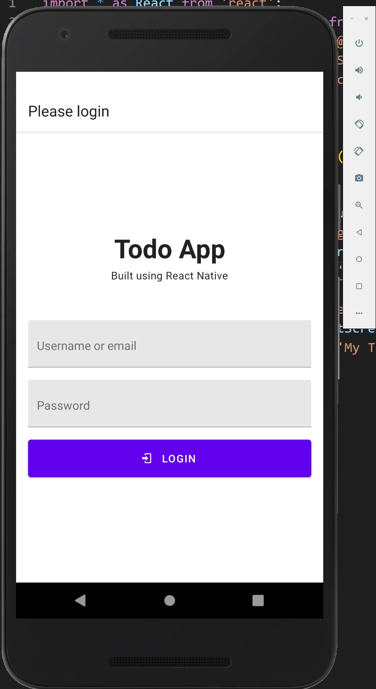
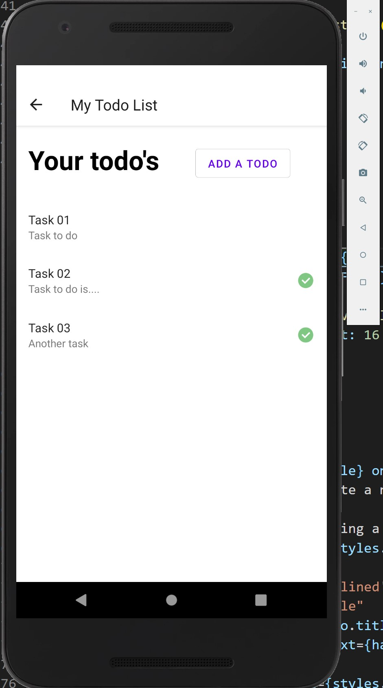
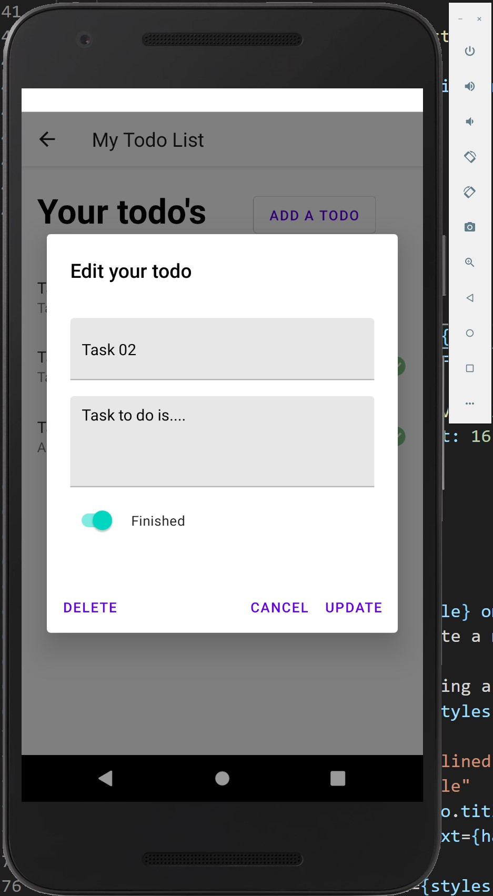

# React Native Project
 React native "Todo list" example for Android, using a local json-server as backend. Just press the "Login" button, no authentication is required.





## Requirements:
- [nodejs](https://nodejs.org/en/)
- [vscode](https://code.visualstudio.com/)
- [yarn](https://yarnpkg.com/lang/en/) (optional NPM package manager)
- [android studio](https://developer.android.com/studio)
- An Android emulator in Android Studio

## Build and run
- (if installed) uninstall the legacy react-native-cli 
```sh
$ npm uninstall -g react-native-cli
```
- install all the npm packages and start the json-server as backend
```sh
$ npm install
$ npm run backend
```
- run the emulator
- build and run the React Native code in the emulator
```sh
$ npm run android
```
or (not tested)
```sh
$ npm run ios
```
